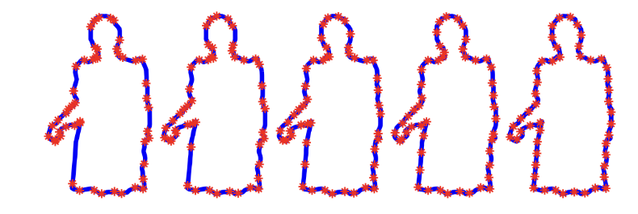

# Geometric Learning of Canonical Parameterizations of 2D-curves

Most datasets in computer vision and medical imaging contain inherent **symmetries**—such as rotations, translations, scalings, or reparameterizations—that influence classification tasks. Traditional neural network pipelines handle these symmetries using **data augmentation**, which increases both computational cost and environmental impact.

This repository presents a more sustainable and principled alternative based on the **geometry of principal fiber bundles**. Instead of augmenting datasets, we directly **mod out symmetries** by constructing a **section** of the bundle, providing a canonical representative for each orbit under the symmetry group.

---

## ⭐ Key Ideas

### 🔸 Modding Out Symmetries
We address symmetries arising from:
- Translations  
- Rotations  
- Scalings  
- Reparameterizations  

By assigning a canonical representative to each orbit, we remove the need for augmentation and simplify the learning problem.

### 🔸 Simple, Interpretable Metrics
The method enables the use of **simple metrics** to measure dissimilarities between objects modulo symmetry, making training more efficient and computationally lighter.

### 🔸 Optimizable Canonical Sections
The chosen section of the bundle can be **optimized** to improve class separation, providing a flexible geometric tool for symmetry-aware learning.

### 🔸 Canonical Curve Parameterization
We introduce a **2-parameter family of canonical parameterizations of curves**, containing the standard constant-speed parameterization as a special case. This family is interesting in its own right and helps illustrate the geometric principles of the method.

---

## 📘 Tutorial & Code

- **Main codebase:**  
  https://github.com/GiLonga/Geometric-Learning  

- **Tutorial notebook (example on a real dataset):**  
  https://github.com/ioanaciuclea/geometric-learning-notebook  

The notebook demonstrates an application of the framework to a dataset of object contours.

---

## 📂 Dataset Used in the Tutorial

The dataset used in the notebook is available at the following link (hosted in another repository):

- **Sweadish Leaves dataset contours**  
  https://github.com/GiLonga/Geometric-Learning/blob/main/leaves_parameterized.mat

- **Flavia_random_rotation.mat**  
  https://github.com/ioanaciuclea/geometric-learning-notebook/blob/main/Flavia_random_rotation.mat  

---

## 🎯 Purpose of This Work

This repository aims to:
- Demonstrate a geometric approach to symmetry-aware learning  
- Provide a sustainable alternative to data augmentation  
- Offer a framework with applications in computer vision, medical imaging, and related fields  

We hope this simple application illustrates the underlying geometric concepts and inspires further exploration of symmetry-informed machine learning.
